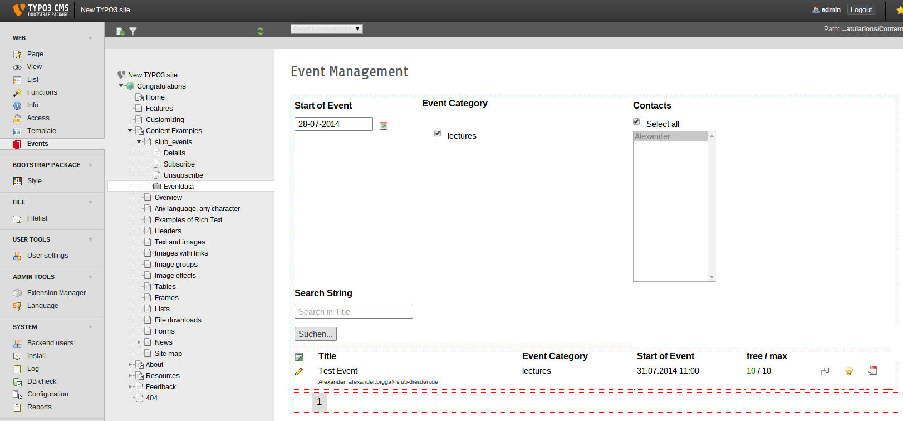
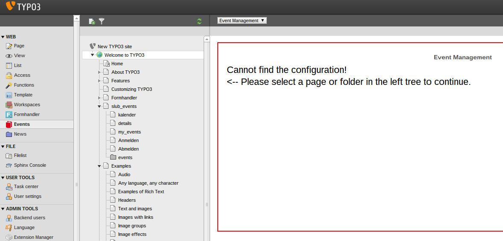

.. ==================================================
.. FOR YOUR INFORMATION
.. --------------------------------------------------
.. -*- coding: utf-8 -*- with BOM.

.. include:: ../Includes.txt

.. _users-manual:

Users manual
============

.. _users-manualpage-setup:

Page Setup
----------

Please imagine the following page structure and put the mentioned
plugins onto these pages:

.. code-block:: none

	Events		<-- plugin "SLUB: Events: Listing", List View
	|-- Details	<-- plugin "SLUB: Events: Listing", Single View
	|-- Subscribe	<-- plugin "SLUB: Events: Registration", Subscribe View
	|-- Unsubscribe	<-- plugin "SLUB: Events: Registration", Unsubscribe View
	`-- Eventdata	<-- Sysfolder for Eventdata

Backend Module
--------------

With the TYPO3 list module, you have to add three basic datatypes to the
"Eventdate" folder:

#. **Category**: The categories of your events like "Tutorial",
   "Lesson", "Workshop", etc. You can create a category tree.
#. **Contact Details**: The name and email address will be used to send
   the confirmation emails on subscription. The picture and the
   description is shown in the detail view and in the category list view
   of the knowledge bar.
#. **Location**: Add location with title, descriptions and links. The
   title will be shown in the ics-invitation.

Optional you can add:

#. **Disciplines**: Disciplines can be used as another filter tree for
   the list view.

If all this is done, you can start using the backend module on the left
column, called "Events" and select the Eventdata-folder or any page
below the slub_events template in the middle column.

	The backend module appears on the right column if a page in the
	pagetreeg has been selected.

**Important:** You have to set the StoragePid of the Eventdata-folder on
some template (see :ref:`set-storage-folder`). Otherwise you get the
following error message:

.. code-block:: none

	Cannot find the configuration!

	<-- Please select a page or folder in the left tree to continue.

	Error if no page or folder is selected with the slub_events template.

Frontend Plugins
----------------

As mentioned in :ref:`users-manualpage-setup` there are several frontend
plugins to list, show and register to events.

SLUB: Events: Listing
_____________________

This plugin has three functions:

- *List View*: list all upcoming events in a chronological
  order. By default only future events (including "today") are shown. You
  can show event only from selected categories, disciplines or contacts.
  You can change the chronological ordering and you can show past events.

- *Single View*: show details of a single event.

- *List Month View*: this is an experimental view with fullcalendar. We
  are playing around with it.

SLUB: Events: Registration
__________________________

This plugin has two functions:

- *Subscribe View*: This shows the registration form.
- *Unsubscribe View*: This is the target plugin to unsubscribe users.
  Unfortunately you have to place it on a separate page.

SLUB: Events: User Panel
________________________

This basic plugin shows all events of a customer. This is currently
working only for our usecase:

- the user is logged in
- the "customer ID" is equal to the fe_user username

SLUB: Events: Knowledge Bar
___________________________

The knowledge bar is a different type of event with only one subscriber.
Technically an event may have multiple categories. This plugin lists
the event ordered by categories. The event itself only provides the
time, subscription and contact details. The descriptions are taken from
the category.

To better understand the concept, have a look at the `SLUB Knowledge Bar <http://www.slub-dresden.de/en/service/knowledge-bar/>`_.

Screenshots
-----------

Some screenshots to show the functionality used at the Saxony State and
University Library in Dresden, Germany (SLUB): `www.slub-dresden.de <http://www.slub-
dresden.de/>`_

.. figure:: ../Images/UserManual/slub-events-list-view.jpg
	:width: 500px
	:alt: Listing View

	Listing of Events

.. figure:: ../Images/UserManual/slub-events-subscription-view.jpg
	:width: 500px
	:alt: Subscription View

	Subscription Form

.. figure:: ../Images/UserManual/slub-events-category-wissensbar-event-list-view.jpg
	:width: 500px
	:alt: Knowledge Bar View

	Knowledge Bar View

.. figure:: ../Images/UserManual/slub-events-category-wissensbar-view.jpg
	:width: 500px
	:alt: Knowledge View

	Knowledge View

