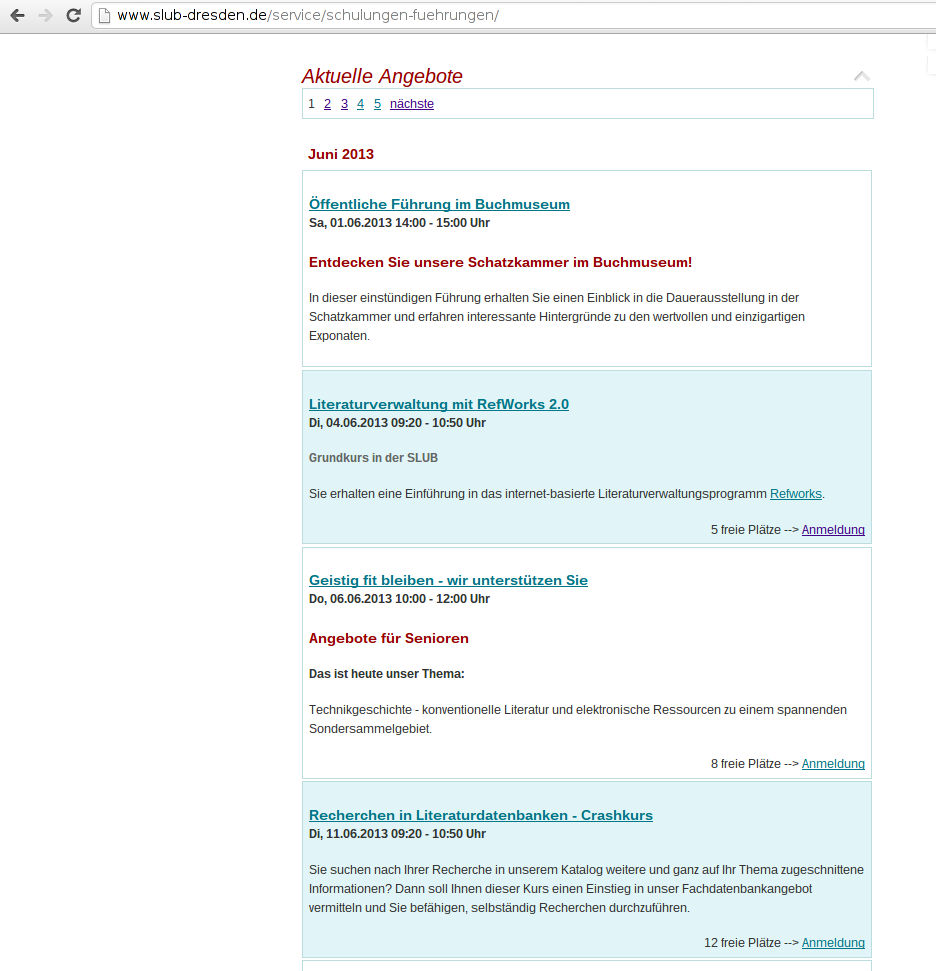
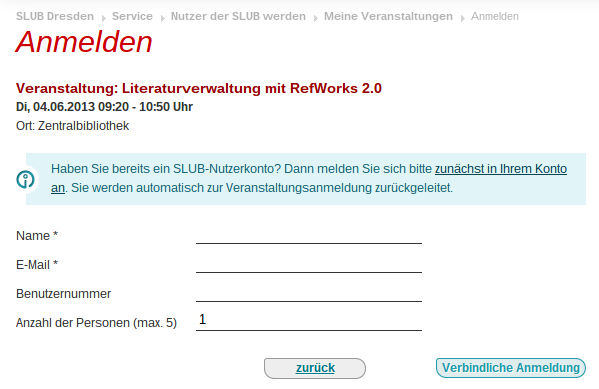

.. ==================================================
.. FOR YOUR INFORMATION
.. --------------------------------------------------
.. -*- coding: utf-8 -*- with BOM.

.. include:: ../Includes.txt

.. _users-manual:

Users manual
============

Please imagine the following page structure and put the mentioned
plugins onto these pages:

.. code-block:: none

	Events		<-- plugin "SLUB: Events: Listing", List View
	|-- Details	<-- plugin "SLUB: Events: Listing", Single View
	|-- Subscribe	<-- plugin "SLUB: Events: Registration", Subscribe View
	|-- Unsubscribe	<-- plugin "SLUB: Events: Registration", Unsubscribe View
	`-- Eventdata	<-- Sysfolder for Eventdata

With the TYPO3 list module, you have to add some basic data to the
"Eventdate" folder:

- Categories: e.g. "tutorials"
- Contacts: The name and email address will be used to send the
  confirmation emails on subscription. The picture and the description
  is only used with the knowledge bar functionality.
- Locations: Add location with title, descriptions and links. The title
  will be shown in the ics-invitation.

If all this is done, you may use the backend module on the left, called
"Events" and select the Eventdata-folder or any page below the
slub_events template.

**Important:** You have to set the StoragePid of the Eventdata-folder on
some template (see :ref:`admin-manual`). Otherwise you get the
following error message:

.. code-block:: none

	"Sorry, the requested view was not found.

	The technical reason is: No template was found. View could not be resolved for action "beList".

Screenshots
-----------

Some screenshots to show the functionality used at the Saxony State and
University Library in Dresden, Germany (SLUB): `www.slub-dresden.de <http://www.slub-
dresden.de/>`_

	Listing of Events

	Subscription Form

.. figure:: ../Images/UserManual/slub-events-category-wissensbar-event-list-view.jpg
	:width: 500px
	:alt: Knowledge Bar View

	Knowledge Bar View

.. figure:: ../Images/UserManual/slub-events-category-wissensbar-view.jpg
	:width: 500px
	:alt: Knowledge View

	Knowledge View

